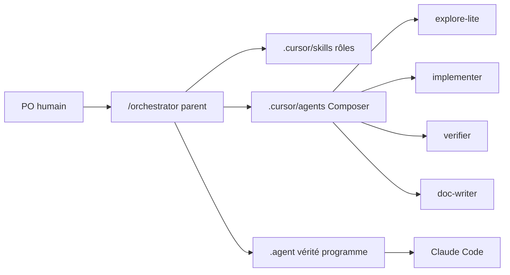

# Playbook Cursor — 40KT1_SENTINEL

Guide PO pour tirer le meilleur de Cursor **en coexistant** avec Claude Code.
Ce dépôt n'a que **deux** acteurs agents et **aucun serveur MCP** : la
coordination passe par `TASKS.md` committé, rien d'autre.

## Carte mentale (1 minute)



| Couche | Rôle |
|--------|------|
| `.agent/` | Vérité programme (règles, index actif, tâches) — **les deux outils** |
| `AGENTS.md` | Contrat uniforme d'entrée |
| `.cursor/rules/` | Contexte toujours-on + règles scopées par chemin |
| `.cursor/skills/` | Rôles à la demande |
| `.cursor/agents/` | Workers économiques |
| `.cursor/hooks/` | Garde-fous shell (anti-push main, anti-secrets, **anti-apply**) |

> **Pas de `.hub/`.** Si un souvenir de session parle de `get_context`, `claim`
> ou de locks, il parle de `40KT1_HQ`, pas de ce dépôt.

## Démarrer une session

1. Ouvrir le dépôt (sur `main` local = miroir de `origin/main`).
2. Nouveau chat Agent. Les rules `alwaysApply` se chargent seules.
3. Pour une tâche : *« utilise le skill coder »* / *architect* / *devsecops*…
4. L'agent lit `.agent/ACTIVE.md` puis le Focus de `TASKS.md` avant de coder.
5. **Vérifier qu'aucune tâche `[~]` de `claude` n'est prise**, puis poser la sienne.

## Orchestrateur (recommandé pour le quotidien)

Parent fort (model picker) + workers économiques (`.cursor/agents/`).

| Skill / agent | Rôle | Modèle |
|---------------|------|--------|
| `/orchestrator` | Classe la demande, choisit le skill, délègue | Parent (picker) |
| `explore-lite` | Cartographie lecture seule | `composer-2.5` |
| `implementer` | Code / tests sur `cursor/*` | `composer-2.5[fast=false]` |
| `verifier` | QA lecture seule + preuves | `composer-2.5[fast=false]` |
| `doc-writer` | Docs / ADR FR | `composer-2.5` |

**Usage :** nouveau chat → modèle « thinking » dans le picker → `/orchestrator`
(ou Alt+Enter pour le garder) → coller la demande.

## Les 7 rôles (skills projet)

| Skill | Quand l'invoquer |
|-------|------------------|
| `po` | Priorisation, périmètre, critères d'acceptation, arbitrage |
| `architect` | ADR, frontières, compromis |
| `coder` | Implémentation sur `cursor/<tâche>` |
| `qa` | Plans de test, vérification PR/SHA, CI rouge |
| `devsecops` | Ansible, CI, secrets, durcissement — **sans apply prod** |
| `tech-writer` | ADR / runbooks / DISCOVERY en FR |
| `orchestrator` | Router la demande vers le bon rôle et les workers |

Le rôle `ux` de HQ n'existe pas ici : ce dépôt ne porte aucune interface.

## Git sur cette machine

```powershell
git fetch origin
git checkout -b cursor/<tache> origin/main
# … travail …
# PR vers main — jamais push main
```

## ⚠️ Ce dépôt vise des machines de production

`patator-tower` sert `hq.40kt1.com`. `patator-standby` porte le miroir et la
relève. Une commande jouée depuis ce dépôt n'est pas une commande de laboratoire.

Le hook `beforeShellExecution` intervient sur `git push`, `.env`, `gh secret`,
`ansible-playbook` et sur toute tentative d'**armement**. Il demande
confirmation ; **une confirmation n'est pas un ordre PO**. La règle reste :
`--check --diff` d'abord, ordre PO ensuite, apply en dernier.

## Checklist « session propre »

- [ ] Branche `cursor/*` (pas de commit orphelin sur `main`)
- [ ] Pas de secret / `.env` dans le diff
- [ ] Aucun `SENTINEL_*_ENABLED` passé à `true` dans le diff
- [ ] `ansible-lint` + `yamllint` verts si `infra/` touché
- [ ] `ruff` + `pytest` verts si `responder/` touché
- [ ] Docs FR à jour si un comportement visible change
- [ ] `TASKS.md` coché seulement si preuves OK
- [ ] PR ouverte ; **pas** de push `main`
